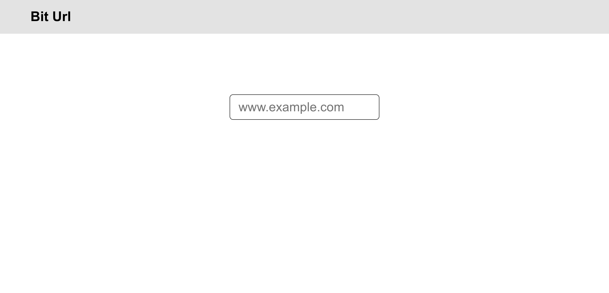
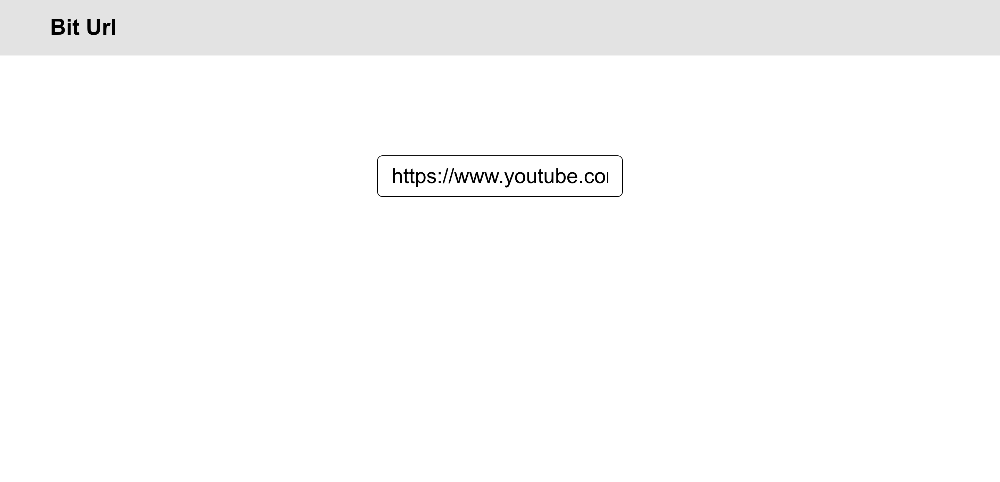
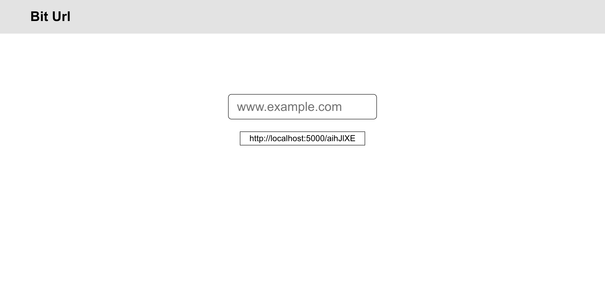

# BitUrl

BitUrl is a url shortner web application similar to bit.ly and tinurul.

# Table of Contents

- [BitUrl](#biturl)
- [Table of Contents](#table-of-contents)
  - [System Architecture](#system-architecture)
  - [Screenshots](#screenshots)
  - [Installation and Launch](#installation-and-launch)
    - [Prerequisites](#prerequisites)
    - [Commands to Run](#commands-to-run)
  - [License](#license)

## System Architecture

The app's backend is in Flask connected to a PostgreSQL database log all urls and visits, and Redis to cache urls used
to increase performance. All of it containerized with Docker, and deployed with docker-compose.

React and Redux is used to power the frontend.

## Screenshots







## Installation and Launch

### Prerequisites

- [Docker](https://docs.docker.com/get-docker/) (and [docker-compose](https://docs.docker.com/compose/install/))
- [yarn](https://yarnpkg.com/getting-started/install)

### Commands to Run

```bash
git clone https://github.com/CuriousIbrahim/bit-url.git
cd bit-url
docker-compose up
```

And then in a seperate terminal (assuming you're in bit-url/ directory)

```bash
cd client
yarn
yarn start
```

## License

[MIT License](LICENSE.txt)
